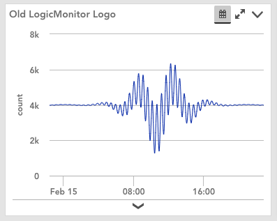
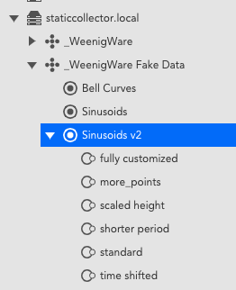
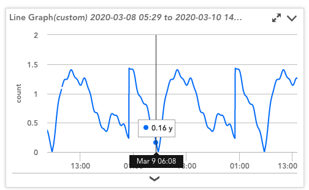
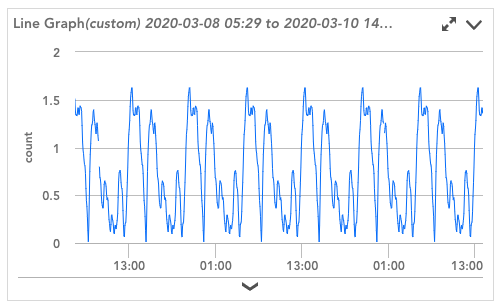
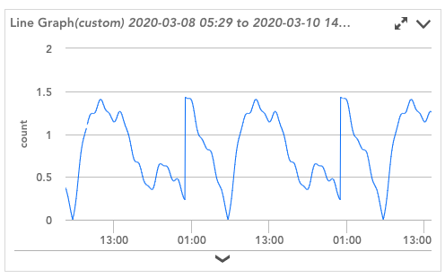

# Generates fake data for display in LogicMonitor

## Bell_Curves
This was a first attempt at a datasource that generated better-than-junk data. We needed a way to display data that looked more realistic than current options.
* bell - simply generates a bell curve based on the time of day, centered around noon(ish).
* lmlogo - an accidental discovery, this datapoint uses the time of day and some complex aliasing to generate something that looks an awful lot like the old LogicMonitor logo. To be honest, this datapoint is the only reason I keep this DS around. It's fun to have the LM logo plotted on a graph on a welcome dashboard. I think I scale the value up by adding 4000 so that it clears the x-axis.

## Sinusoids
This was the second attempt at generating fake data that looked more realistic. Once the LM logo fell out of the above DS, I decided it was a good time to fork to this one.

This DS replicates what a single instance DS would look like. The data generally grows over the course of the day then goes back down.

You can set the following properties to manipulate the data somewhat:
* sine.timeshift: should shift left or right so that you can make the max point of the hump happen at any time you want.
* sine.scale: should shift the number larger or smaller in the y direction.
* sine.period: number of seconds before repeating (defaults to 1440, or one day)

## Sinusoids v2
This was my final attempt at making some fake data before switching to a better method of replaying real, sanitized data (can't get more real than real data replayed).
This one allows you to add as many instances as you want. Each instance can have the same properties as the previous version:
* sine.timeshift: should shift left or right so that you can make the max point of the hump happen at any time you want.
* sine.scale: should shift the number larger or smaller in the y direction.
* sine.period: number of seconds before repeating (defaults to 1440, or one day)

This time, set the properties on the instances after you add them through "Add additional monitoring". One additional property, `sine.addlpoints` allows you to specify the number of datapoints to return per instance (up to 10). Semi-random values will be generated for the other points.
This is what some instances could be:

